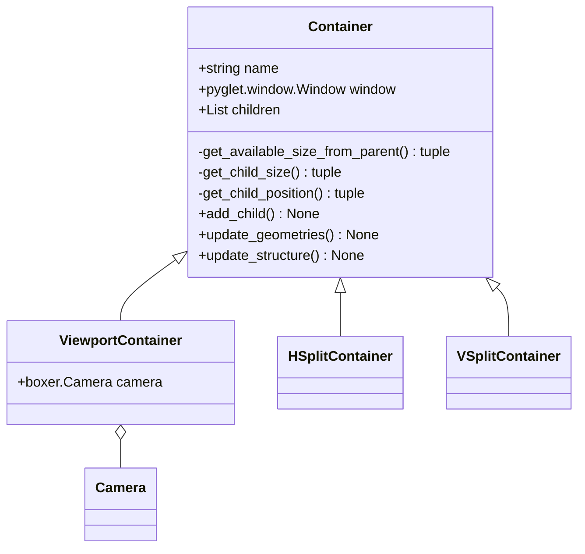

# boxer
workflow tool

# Containers

A tree of **Containers** is made by adding children to a single root **Container** using ``.add_child()``

Once a tree is constructed, call ``.update_structure()`` to initialise the tree's knowledge of itself. This identifies leaves, calculates node depth and unique ids, et cetera.

Before a tree is drawn, call ``.update_geometries()`` on the root **Container**.

Call ``.update_geometries()`` in the ``window.on_resize()`` event

## Containers class diagram

